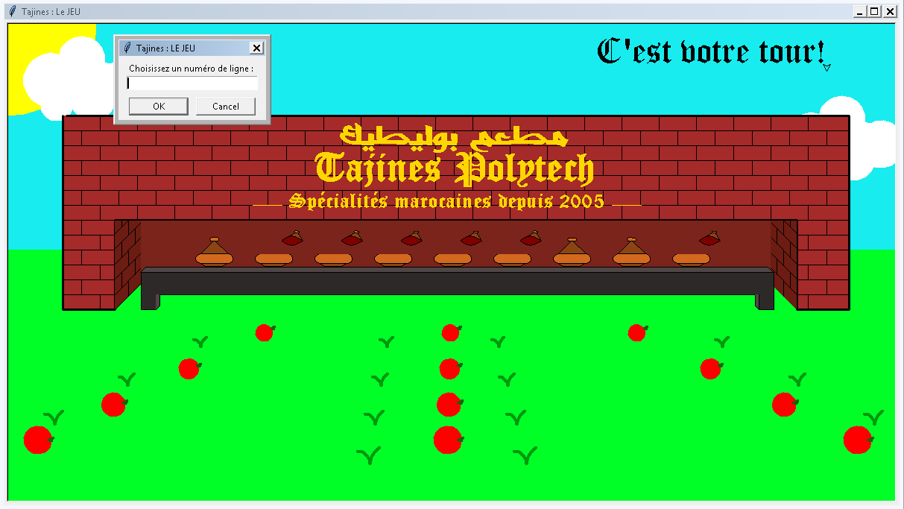

# PROJET  PYTHON PeiP1 : Jeu de quilles V.2019
## Premier Projet Programmation Impérative sous Python
###### réalisé par Fattah Abdeladem Saoud & Boubia Marouane en décembre 2019 - janvier 2020

### Principe de base du jeu de quilles:
Le joueur joue contre l'ordinateur. Au départ, un nombre de quilles est tiré au hasard. 
Le joueur commence puis à chaque tour, le joueur ou l'ordinateur choisit de tirer au milieu, à gauche ou à droite d'une ligne de quilles. 
Quand on tire au milieu, 2 quilles sont descendues, quand on tire à droite ou à gauche, une seule quille est descendue. 
Quand on descend 2 quilles au milieu, la ligne de quille est coupée en deux. 
Celui qui descend la dernière quille a gagné.

### Points sur l'interface :
Les quilles seront représentées par un dessin fait avec turtle, et elles seront situées dans un décor. 
Chaque projet sera différent, vous devrez laisser parler votre créativité pour choisir un thème. 
Il vous faudra choisir un dessin simple pour les quilles débout, et un dessin modifié pour les quilles couchées. 
Le décor inclue obligatoirement :
*  Une zone pour afficher ce que vient de jouer l'ordinateur,
*  Une zone pour afficher les quilles,
*  Un élément du décor devra se trouver à deux endroits différents (par exemple, 2 montagnes, ou deux tables)
*  Un élément du décor (différent des quilles) devra être répétitif (par exemple, une forêt qui contient plusieurs arbres, une tribune de foot qui contient plusieurs spectateurs ...).

### Notre projet :
Notre projet a été expliqué en détail dans le fichier PDF demandé, à savoir le rapport (Rapport final de Projet.pdf)
L'interface de notre jeu ressemble à cela (lancé sous Windows/ version windows du jeu):

###### Group : Abdeladem Saoud Fattah | Marouane Boubia